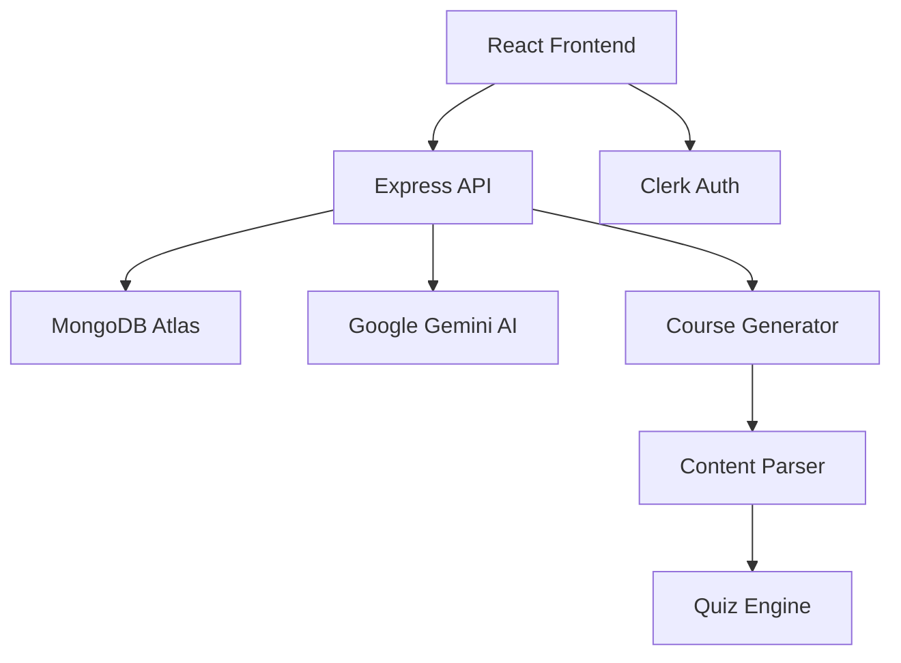

# 🌟 Learn-Sphere

<div align="center">


**🚀 AI-Powered Personalized Learning Platform**

*Transform your learning journey with intelligent course generation, adaptive content, and gamified experiences*

[](https://www.typescriptlang.org/)
[](https://developer.mozilla.org/en-US/docs/Web/JavaScript)
[](https://reactjs.org/)
[](https://nodejs.org/)
[](https://www.mongodb.com/)

[✨ Demo](#demo) • [🚀 Features](#features) • [🛠️ Installation](#installation) • [📚 Usage](#usage) • [🤝 Contributing](#contributing)

</div>

---

## 🎯 Overview

**Learn-Sphere** is a cutting-edge AI-powered learning platform that revolutionizes how you learn. Using advanced AI technology powered by Google's Gemini, it generates personalized courses, provides intelligent tutoring, and gamifies your learning experience with XP points and progress tracking.

### ✨ What Makes Learn-Sphere Special?

- 🧠 **AI Course Generation**: Create comprehensive courses on any topic instantly
- 🎮 **Gamified Learning**: Earn XP points, unlock achievements, and track progress
- 💬 **Intelligent Tutor**: Get personalized help with an AI chat assistant
- 📱 **Modern UI**: Beautiful, responsive design with dark/light mode support
- 🔐 **Secure Authentication**: Powered by Clerk for seamless user management
- 📊 **Progress Tracking**: Monitor your learning journey with detailed analytics

---

## 🎬 Demo

<!-- [](https://your-demo-link.com) -->

<!-- *Click the image above to see Learn-Sphere in action!* -->

---

## 🚀 Features

### 🎯 Core Features

| Feature | Description |
|---------|-------------|
| **🤖 AI Course Generation** | Generate complete courses with chapters, lessons, and quizzes using Google Gemini AI |
| **📚 Comprehensive Content** | Each course includes detailed HTML content, interactive quizzes, and multimedia resources |
| **🎮 Gamification System** | Earn XP points, track progress, and unlock achievements as you learn |
| **💬 AI Tutor Chat** | Get instant help and explanations from your personal AI learning assistant |
| **📱 Responsive Design** | Perfect experience across desktop, tablet, and mobile devices |
<!-- | **🌙 Dark/Light Mode** | Choose your preferred theme for comfortable learning | -->
| **🔒 User Authentication** | Secure login and user management with Clerk |
| **📊 Progress Analytics** | Detailed insights into your learning journey and achievements |

### 🛠️ Technical Features

- **Real-time Course Generation**: Lightning-fast AI-powered content creation
- **RESTful API**: Clean, well-documented backend architecture
- **Type Safety**: Full TypeScript implementation for robust development
- **Modern Tech Stack**: React 19, Node.js, Express, MongoDB
- **Responsive UI**: TailwindCSS for beautiful, adaptive designs
- **Error Handling**: Comprehensive error management and user feedback

---

## 🏗️ Architecture & Tech Stack

<div align="center">

### 🏛️ **System Architecture**



</div>

### 🛠️ **Technology Stack**

#### **Frontend** 
- ⚛️ **React 18** with TypeScript for type-safe development
- ⚡ **Vite** for lightning-fast build and development
- 🎨 **Tailwind CSS** for modern, responsive styling
- 🔐 **Clerk** for authentication and user management
- 📡 **Axios** for API communication
- 🎭 **Lucide React** for beautiful icons

#### **Backend**
- 🟢 **Node.js** with Express.js framework
- 🍃 **MongoDB** with Mongoose ODM
- 🤖 **Google Gemini AI** for content generation
- 🔒 **JWT** for secure token management
- 🌐 **CORS** for cross-origin resource sharing

#### **Development & Deployment**
- 📦 **npm/yarn** for package management
- 🔧 **ESLint & Prettier** for code quality
- 🚀 **Vercel/Netlify** ready deployment
- 📊 **MongoDB Atlas** for cloud database

---

---

## 🛠️ Installation

### Prerequisites

- **Node.js** (v16 or higher)
- **MongoDB** (local or cloud instance)
- **Google Gemini API Key**
- **Clerk Account** for authentication

### Quick Start

1. **Clone the repository**
   ```bash
   git clone https://github.com/arpan7sarkar/Learn-Sphere.git
   cd Learn-Sphere
   ```

2. **Setup Backend**
   ```bash
   cd Backend
   npm install
   
   # Create environment file
   cp .env.example .env
   # Add your environment variables (see configuration below)
   
   npm run dev
   ```

3. **Setup Frontend**
   ```bash
   cd ../Frontend
   npm install
   
   # Create environment file
   cp .env.example .env
   # Add your Clerk configuration
   
   npm run dev
   ```

4. **Access the application**
   - Frontend: `http://localhost:5173`
   - Backend: `http://localhost:3001`

### 🔧 Environment Configuration

**Backend (.env)**
```env
PORT=3001
MONGODB_URI=your_mongodb_connection_string
GEMINI_API_KEY=your_google_gemini_api_key
NODE_ENV=development
```

**Frontend (.env)**
```env
VITE_CLERK_PUBLISHABLE_KEY=your_clerk_publishable_key
VITE_API_BASE_URL=http://localhost:3001/api
```

---

## 📚 Usage

### 🎯 Getting Started

1. **Sign Up/Login**: Create your account using Clerk authentication
2. **Generate a Course**: Enter any topic and difficulty level
3. **Start Learning**: Navigate through chapters and complete lessons
4. **Earn XP**: Complete quizzes and lessons to gain experience points
5. **Chat with AI**: Use the AI tutor for help and explanations
6. **Track Progress**: Monitor your learning journey in the dashboard

### 🎮 Gamification System

- **📈 XP Points**: Earn points for completing lessons and quizzes
- **🏆 Achievements**: Unlock badges for milestones and streaks
- **📊 Progress Tracking**: Visual progress bars and completion statistics
- **🎯 Learning Goals**: Set and track personal learning objectives

### 🤖 AI Features

- **Course Generation**: Create courses on any topic with detailed content
- **Intelligent Tutoring**: Get personalized explanations and help
- **Adaptive Content**: Content difficulty adjusts to your learning pace
- **Smart Recommendations**: Discover new topics based on your interests

---

## 🔌 API Endpoints

### 📚 Courses
- `GET /api/courses?userId={id}` - Get user's courses
- `POST /api/generate-course` - Generate new course
- `DELETE /api/courses/:courseId?userId={id}` - Delete course

### 💬 Chat
- `POST /api/chat` - Chat with AI tutor

### 🎮 XP System
- `GET /api/xp?userId={id}` - Get user XP data
- `POST /api/xp/award` - Award XP points

---

## 🤝 Contributing

We welcome contributions! Here's how you can help:

### 🌟 Ways to Contribute

- 🐛 **Bug Reports**: Found a bug? Open an issue!
- ✨ **Feature Requests**: Have an idea? We'd love to hear it!
- 🔧 **Code Contributions**: Submit pull requests for improvements
- 📖 **Documentation**: Help improve our docs and guides
- 🎨 **Design**: Contribute to UI/UX improvements

### 📝 Development Setup

1. Fork the repository
2. Create a feature branch: `git checkout -b feature/amazing-feature`
3. Make your changes and test thoroughly
4. Commit: `git commit -m 'Add amazing feature'`
5. Push: `git push origin feature/amazing-feature`
6. Open a Pull Request

### 🎯 Coding Standards

- Use TypeScript for type safety
- Follow ESLint configuration
- Write meaningful commit messages
- Add tests for new features
- Update documentation as needed

---

## 🚀 Roadmap

### 🎯 Upcoming Features

- [ ] **📱 Mobile App**: Native iOS and Android applications
- [ ] **🌐 Multi-language Support**: Internationalization and localization
- [ ] **🎥 Video Integration**: YouTube video recommendations and embedding
- [ ] **👥 Social Learning**: Study groups and peer collaboration
- [ ] **📊 Advanced Analytics**: Detailed learning insights and reports
- [ ] **🎨 Course Templates**: Pre-built course structures for popular topics
- [ ] **🔄 Offline Mode**: Download courses for offline learning
- [ ] **🎤 Voice Interaction**: Voice commands and audio lessons

---

## 🛡️ License

This project is licensed under the **ISC License** - see the [LICENSE](LICENSE) file for details.

---

## 👨‍💻 Author

**Arpan Sarkar**

- 🌐 GitHub: [@arpan7sarkar](https://github.com/arpan7sarkar)
- 💼 LinkedIn: [Connect with me](https://linkedin.com/in/arpan7sarkar)
- 📧 Email: contact.arpan.sarkar@gmail.com

---

## 🙏 Acknowledgments

- **Google Gemini AI** for powerful content generation
- **Clerk** for seamless authentication
- **MongoDB** for reliable data storage
- **React & TypeScript** for robust frontend development
- **TailwindCSS** for beautiful, responsive design

---

<div align="center">

### 🌟 Star this repository if you found it helpful! 🌟

**Made with ❤️ by [Arpan Sarkar](https://github.com/arpan7sarkar)**

</div>
